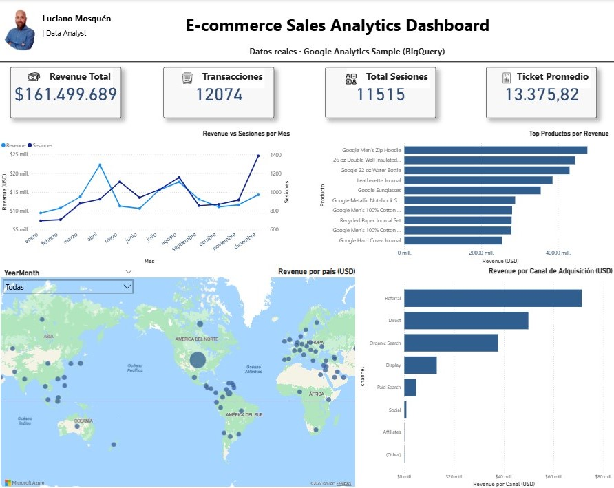
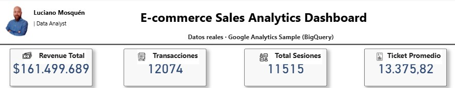
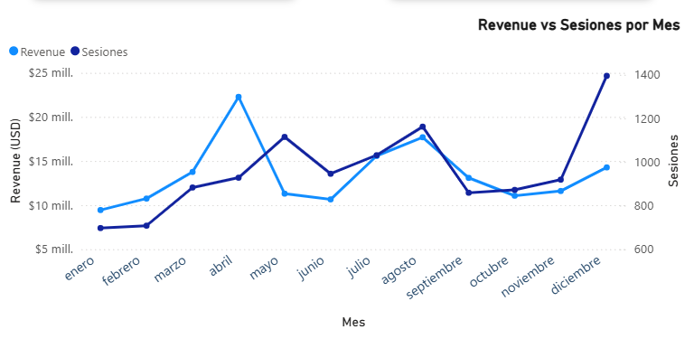
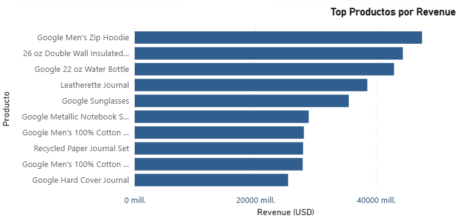
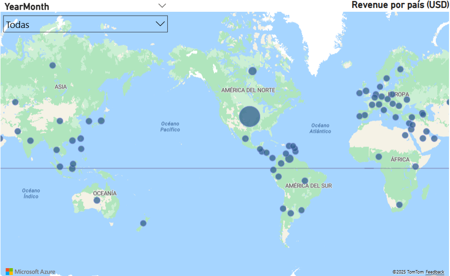
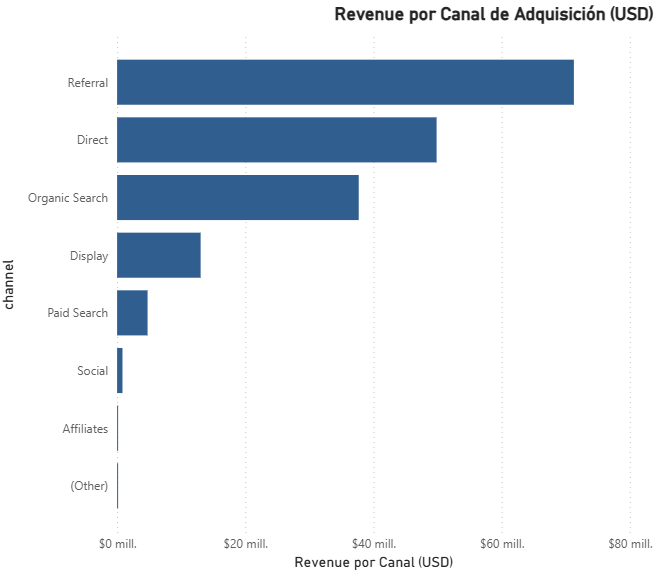

📊 E-commerce Sales Analytics Dashboard
Power BI + Google BigQuery + SQL

Proyecto de práctica y portfolio donde conecto tres cosas que me interesan mucho:
datos reales, SQL en BigQuery y visualización en Power BI.

La idea no es solo “hacer un gráfico”, sino mostrar un flujo end-to-end:
desde las consultas en BigQuery hasta un dashboard limpio y listo para tomar decisiones.

---

🔍 Resumen rápido

- Dataset: Google Analytics Sample (BigQuery)
- Objetivo: analizar performance de un e-commerce (revenue, sesiones, productos, países, canales)
- Herramientas: BigQuery + SQL, Power BI, DAX, Power Query
- Resultado: dashboard ejecutivo con KPIs, evolución temporal, top productos, mapa y canales de adquisición

🧠 Qué practico en este proyecto

- Escritura de consultas SQL en BigQuery sobre datos reales
- Construcción de tablas analíticas (staging) y exportación a CSV
- Modelado en Power BI sin relaciones complejas (cada tabla alimenta sus propios visuals)
- Creación de medidas DAX para KPIs y métricas derivadas
- Diseño de un dashboard claro, legible y con criterio visual
- Documentación del proyecto para portfolio (este README)


---

📂 Estructura del repositorio

```plaintext
Ecommerce-Sales-Analytics-Dashboard/
│
├── sql/
│   ├── 01_daily_revenue.sql
│   ├── 02_product_performance.sql
│   ├── 03_customer_segments.sql
│   ├── 04_geo_revenue.sql
│   └── 05_channel_performance.sql
│
├── data/
│   ├── daily_revenue.csv
│   ├── product_performance.csv
│   ├── customer_segments.csv
│   ├── geo_revenue.csv
│   └── channel_performance.csv
│
├── pbix/
│   └── Ecommerce_Sales_Analytics.pbix
│
└── images/
    ├── dashboard_full.png
    ├── kpis.png
    ├── line_chart.png
    ├── top_products.png
    ├── map.png
    └── channels.png
```


---

📈 Qué muestra el dashboard

• KPIs ejecutivos
  – Revenue total (USD)
  – Total de sesiones
  – Total de transacciones
  – Ticket promedio

• Evolución en el tiempo
  – Gráfico de líneas con Revenue vs Sesiones por mes

• Productos
  – Top productos por revenue

• Funnel de conversión
  – Sesiones → Transacciones → Revenue
  – Tabla manual para el embudo + medida DAX para el valor de cada etapa

• Geografía
  – Mapa de revenue por país, con burbujas y tooltips (revenue, sesiones, transacciones)

• Canales de adquisición
  – Revenue por canal (Direct, Organic Search, Referral, etc.)

La idea es que alguien pueda ver el dashboard y entender rápido:
de dónde viene el revenue, qué productos rinden mejor, qué países aportan más y qué canales funcionan mejor.

---

⚙ Tecnologías y conceptos usados

• BigQuery
  – Lectura de tablas de Google Analytics Sample
  – Uso de funciones de fecha, agregaciones, CTEs
  – Generación de tablas analíticas para:
    · Revenue diario
    · Product performance
    · Segmentos RFM
    · Geo (país)
    · Canales de adquisición

• Power BI
  – Importación de CSV como tablas de staging
  – Medidas DAX para KPIs y métricas derivadas
  – Visualizaciones (KPIs, líneas, barras, funnel, mapa)
  – Diseño con foco en claridad antes que en “efectos especiales”

---

🧩 Cómo usar este proyecto

1. Clonar o descargar el repositorio.
2. Abrir el archivo pbix/Ecommerce_Sales_Analytics.pbix en Power BI Desktop.
3. Explorar las páginas, medidas DAX y tablas.
4. Revisar las consultas en la carpeta sql/ si querés ver cómo se armaron los datasets en BigQuery.

---

🎯 Por qué lo incluyo en mi portfolio

Porque resume varias cosas que quiero mostrar como analista de datos:

- Puedo trabajar con datos reales en BigQuery usando SQL.
- Entiendo cómo pasar de “datos crudos” a tablas analíticas útiles.
- Sé modelar y construir un dashboard en Power BI que se vea profesional.
- Me interesa tanto la parte técnica como el diseño y la comunicación de resultados.

---


## 📊 Vista previa del dashboard

### 🔹 Dashboard completo  


---

### 🔹 KPIs principales  


---

### 🔹 Revenue vs Sesiones por Mes  


---

### 🔹 Top Productos por Revenue  


---

### 🔹 Revenue por país (USD)  


---

### 🔹 Revenue por Canal de Adquisición (USD)  


---

## 👋 Sobre mí

Soy Luciano Mosquén, Senior Analyst con foco en negocio y datos. Me interesa el cruce entre analytics, performance y toma de decisiones en empresas digitales.

Me gusta trabajar con datos, automatizar tareas, crear dashboards claros y seguir aprendiendo herramientas nuevas.

**LinkedIn:** https://www.linkedin.com/in/lucianomosquen  
**Email:** luciano.mosquen@gmail.com
